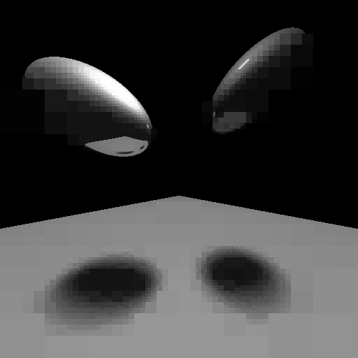

School Project for Software Tools and Systems (CSCB09). A program that stores gray-scale images into quad trees then
reconstructs them with various depths and thresholds that down-scales the resolution. 

USAGE:

Compilation

```shell
gcc quad.c pgmio.c roundtrip.c
```

Running the program

```shell
a.exe inputfile outputfile threshold maximum depth
```

EXAMPLE:

```shell
gcc quad.c pgmio.c roundtrip.c
a.exe test.pgm output.pgm 50 80
```

test.pgm: 

 

output.pgm:


